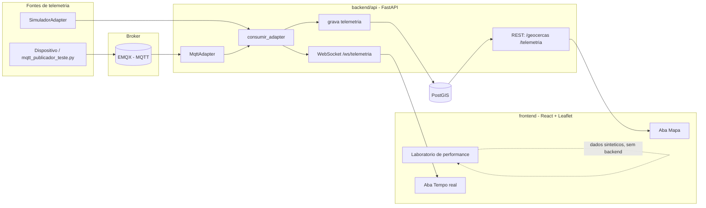

# map-stack

Repo de estudo pratico de engenharia geoespacial: geometria, PostGIS, telemetria em tempo real (WebSocket + MQTT) e visualizacao em mapa. Stack: Python (`backend/`) + React (`frontend/`).

## Arquitetura



Qualquer fonte de telemetria (simulador, MQTT, e o que vier depois) implementa a mesma interface `IngestAdapter` (`backend/api/ingest/base.py`) e passa pelo mesmo caminho: grava no PostGIS e propaga via WebSocket. O frontend nunca sabe de onde a posicao veio.

## Estrutura

```
backend/
  01_geometria/   marco 1 -- Shapely/Pyproj, sem banco
  02_postgis/     marco 2 -- SQL puro (setup, exemplos, exercicios)
  api/            marcos 3/5/6 -- FastAPI + GeoAlchemy2 + WebSocket + adapters
    ingest/         interface IngestAdapter + SimuladorAdapter + MqttAdapter
  tests/          pytest (unitarios + integracao)
  pyproject.toml  Poetry (Python 3.13, pyenv)

frontend/
  src/            Vite + React + TypeScript + react-leaflet
  (roda 100% em container Docker -- nada de Node instalado no host)

docker-compose.yml   postgis + emqx (broker MQTT) + frontend
```

## Subindo tudo

```
docker compose up -d              # postgis, emqx, frontend
cd backend
poetry install
poetry run python api/main.py     # API em http://127.0.0.1:8000 (docs em /docs)
```

Front: http://localhost:5173 -- abas **Mapa**, **Laboratorio de performance** e **Tempo real**.
Dashboard do EMQX: http://localhost:18083 (login `admin` / `public`).

## Testes

```
# backend (precisa do docker compose up -d rodando)
cd backend
poetry run pytest -v

# frontend (dentro do container)
docker compose exec frontend npm test
```

## Roadmap / historico dos marcos

1. **Geometria pura** (`backend/01_geometria/`) — Shapely + Pyproj, sem banco nem API. Points/LineStrings/Polygons, CRS (WGS84 vs Web Mercator) e distancia geodesica.
   ```
   poetry run python 01_geometria/exemplo.py     # exemplos comentados
   poetry run python 01_geometria/exercicios.py  # exercicios
   ```

2. **PostGIS** (`backend/02_postgis/`) — Docker com `postgis/postgis`, queries espaciais em SQL puro (`ST_Contains`, `ST_Distance`, `ST_Intersects`, indices GiST).
   ```
   docker compose up -d postgis
   docker compose exec -T postgis psql -U mapstack -d mapstack < backend/02_postgis/01_setup.sql
   docker compose exec -T postgis psql -U mapstack -d mapstack < backend/02_postgis/02_exemplo.sql
   docker compose exec -T postgis psql -U mapstack -d mapstack < backend/02_postgis/03_exercicios.sql
   ```

3. **FastAPI + GeoAlchemy2** (`backend/api/`) — API expondo os dados espaciais como GeoJSON.
   ```
   poetry run python api/main.py
   poetry run python api/exercicios.py   # exercicio: ST_DWithin via SQLAlchemy
   ```

4. **React + Leaflet** (`frontend/`) — camadas base (OpenStreetMap/satelite Esri) + overlays (geocercas/telemetria) vindos da API, e um **Laboratorio de performance** que compara custo de renderizar milhares de pontos como marcador DOM vs circulo SVG vs circulo Canvas, com contador de FPS ao vivo.
   ```
   docker compose up -d frontend
   ```

5. **Telemetria em stream** — endpoint WebSocket (`/ws/telemetria`) e um simulador de movimento (geodesia real via `Geod.fwd`) que grava no banco e transmite cada posicao nova aos clientes conectados.
   ```
   poetry run python api/exercicios_movimento.py   # exercicio: geodesia direta
   ```

6. **Adapters de ingestao** (`backend/api/ingest/`) — a logica de "gravar + transmitir" foi extraida para um consumidor generico (`consumir_adapter`) que funciona com qualquer fonte que implemente `IngestAdapter`. Hoje existem duas: `SimuladorAdapter` (o simulador do marco 5) e `MqttAdapter` (escuta um topico no broker EMQX, subindo via `docker-compose.yml`).
   ```
   docker compose up -d emqx
   poetry run python api/ingest/mqtt_publicador_teste.py   # simula um dispositivo publicando
   ```
