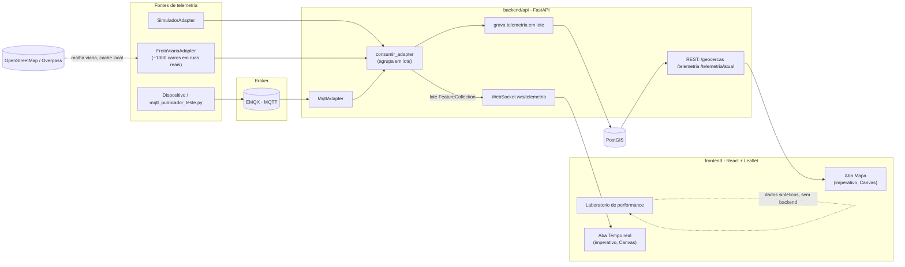

# map-stack

Repo de estudo pratico de engenharia geoespacial: geometria, PostGIS, telemetria em tempo real (WebSocket + MQTT) e visualizacao em mapa. Stack: Python (`backend/`) + React (`frontend/`).

## Arquitetura



Qualquer fonte de telemetria (simulador, frota viaria, MQTT, e o que vier depois) implementa a mesma interface `IngestAdapter` (`backend/api/ingest/base.py`) e passa pelo mesmo caminho: grava no PostGIS e propaga via WebSocket, sempre em **lote** (nao uma posicao por vez -- ver "Licoes aprendidas" abaixo). O frontend nunca sabe de onde a posicao veio.

## Estrutura

```
backend/
  01_geometria/   marco 1 -- Shapely/Pyproj, sem banco
  02_postgis/     marco 2 -- SQL puro (setup, exemplos, exercicios, indices)
  api/            marcos 3/5/6 -- FastAPI + GeoAlchemy2 + WebSocket + adapters
    ingest/
      base.py               interface IngestAdapter (contrato comum)
      simulador_adapter.py  2 veiculos ficticios (marco 5)
      mqtt_adapter.py       escuta um topico no EMQX
      mqtt_publicador_teste.py  simula um dispositivo publicando
      rede_viaria.py        baixa/faz cache da malha viaria real (Overpass)
      frota_viaria.py       ~1000 carros andando sobre a malha real
      cache_rede_viaria.json   cache da malha (comitado -- evita depender do Overpass)
  tests/          pytest (unitarios + integracao)
  pyproject.toml  Poetry (Python 3.13, pyenv)

frontend/
  src/            Vite + React + TypeScript + react-leaflet
  (roda 100% em container Docker -- nada de Node instalado no host)

docker-compose.yml   postgis + emqx (broker MQTT) + frontend
```

## Subindo tudo

```
docker compose up -d              # postgis, emqx, frontend
cd backend
poetry install
poetry run python api/main.py     # API em http://127.0.0.1:8000 (docs em /docs)
```

Front: http://localhost:5173 -- abas **Mapa**, **Laboratorio de performance** e **Tempo real**.
Dashboard do EMQX: http://localhost:18083 (login `admin` / `public`).

## Testes

```
# backend (precisa do docker compose up -d rodando)
cd backend
poetry run pytest -v

# frontend (dentro do container)
docker compose exec frontend npm test
```

## Endpoints da API

| Metodo/rota                                         | O que faz                                                                |
| --------------------------------------------------- | ------------------------------------------------------------------------ |
| `GET /geocercas`                                  | Todas as geocercas, GeoJSON                                              |
| `GET /telemetria?veiculo_id=&limite=`             | Historico de telemetria (mais recentes primeiro),`limite` padrao 500   |
| `GET /telemetria/atual`                           | So a posicao MAIS RECENTE de cada veiculo (o que a aba Mapa usa)         |
| `GET /telemetria/proximos?lon=&lat=&raio_metros=` | Veiculos a ate X metros de um ponto (`ST_DWithin`)                     |
| `WS /ws/telemetria`                               | Stream: cada mensagem e um`FeatureCollection` (lote) de posicoes novas |

## Roadmap / historico dos marcos

1. **Geometria pura** (`backend/01_geometria/`) — Shapely + Pyproj, sem banco nem API. Points/LineStrings/Polygons, CRS (WGS84 vs Web Mercator) e distancia geodesica.

   ```
   poetry run python 01_geometria/exemplo.py     # exemplos comentados
   poetry run python 01_geometria/exercicios.py  # exercicios
   ```
2. **PostGIS** (`backend/02_postgis/`) — Docker com `postgis/postgis`, queries espaciais em SQL puro (`ST_Contains`, `ST_Distance`, `ST_Intersects`, indices GiST + B-tree por tempo).

   ```
   docker compose up -d postgis
   docker compose exec -T postgis psql -U mapstack -d mapstack < backend/02_postgis/01_setup.sql
   docker compose exec -T postgis psql -U mapstack -d mapstack < backend/02_postgis/02_exemplo.sql
   docker compose exec -T postgis psql -U mapstack -d mapstack < backend/02_postgis/03_exercicios.sql
   ```
3. **FastAPI + GeoAlchemy2** (`backend/api/`) — API expondo os dados espaciais como GeoJSON.

   ```
   poetry run python api/main.py
   poetry run python api/exercicios.py   # exercicio: ST_DWithin via SQLAlchemy
   ```
4. **React + Leaflet** (`frontend/`) — camadas base (OpenStreetMap/satelite Esri) + overlays (geocercas/telemetria) vindos da API, e um **Laboratorio de performance** que compara custo de renderizar milhares de pontos como marcador DOM vs circulo SVG vs circulo Canvas, com contador de FPS ao vivo.

   ```
   docker compose up -d frontend
   ```
5. **Telemetria em stream** — endpoint WebSocket (`/ws/telemetria`) e um simulador de movimento (geodesia real via `Geod.fwd`) que grava no banco e transmite cada posicao nova aos clientes conectados.

   ```
   poetry run python api/exercicios_movimento.py   # exercicio: geodesia direta
   ```
6. **Consolidacao: adapters, testes, docs, escala** (`backend/api/ingest/`) — reestruturou o repo em `backend/`/`frontend/`; extraiu a logica de "gravar + transmitir" para um consumidor generico (`consumir_adapter`) que funciona com qualquer `IngestAdapter`; adicionou `MqttAdapter` (broker **EMQX**) e `FrotaViariaAdapter` (~1000 carros andando sobre a malha viaria REAL do centro de SP, baixada do OpenStreetMap via Overpass -- cada carro segue no a no do grafo, nunca corta caminho por cima de quarteirao); testes automatizados (pytest + Vitest).

   ```
   docker compose up -d emqx
   poetry run python api/ingest/mqtt_publicador_teste.py   # simula um dispositivo publicando
   ```

## Evolucao natural: onde dados de telemetria moram

O dado muda de "casa" conforme fica mais velho, por "temperatura":

| Camada | Pergunta | Cresce? | Ferramenta tipica | Aqui |
| --- | --- | --- | --- | --- |
| Quente (atual) | Onde esta X agora? | Nao | Redis (`SET`/`GEOADD`) | `telemetria_atual`, UPSERT |
| Morna (recente) | O que aconteceu nas ultimas horas? | Com teto | TimescaleDB, InfluxDB | `telemetria` + TTL de 1h |
| Fria (arquivo) | O que aconteceu ha meses/anos? | Sem teto, barato/GB | S3/GCS em Parquet | Nao implementado |

O caminho natural de evolucao seria `dispositivo -> broker durável (Kafka/MQTT) -> atualiza a quente + grava a morna com retencao + arquiva a fria em lote` -- ja e a forma deste repo (`adapter -> consumir_adapter -> telemetria_atual + telemetria com TTL`), so com Postgres no lugar de Redis+TimescaleDB e sem camada fria (nao precisamos de arquivo longo aqui).

**Por que Postgres/UPSERT em vez de Redis:** Postgres usa MVCC, entao todo UPSERT cria uma nova versao da linha (limpa depois via `VACUUM`) mesmo numa tabela que nunca cresce -- Redis seria mais barato pra esse padrao. Ficamos com Postgres porque varios processos precisam ver o mesmo estado, ele sobrevive a reinicio, e ja pagavamos essa infra pelo historico/queries espaciais. Em escala de frota real, Redis na camada quente e o caminho natural.

Pergunta a fazer antes de gravar algo: *quem vai ler isso depois, e quando?* So o valor mais recente -> quente. Ultimas horas -> morna, com TTL desde o dia 1. Anos depois -> fria, fora do banco operacional. O bug desta sessao foi nunca ter feito essa pergunta, ate a tabela chegar a 1 milhao de linhas.

## Licoes aprendidas (bugs reais, encontrados rodando o sistema)

Ao ligar a frota de 1000 carros, dois problemas reais apareceram -- vale documentar porque sao erros classicos de sistemas geoespaciais em escala, nao coisas obvias de antemao:

1. **Historico sem limite trava a tela.** A aba Mapa buscava `/telemetria` inteiro (todo o historico) e desenhava cada linha. Com o simulador rodando havia horas, isso ja passava de 2000 pontos e so crescia. Correcao: endpoint `/telemetria/atual` (so a posicao mais recente por veiculo, via `DISTINCT ON`) + `limite` no `/telemetria` historico + indices por tempo.
2. **`LayersControl.Overlay` nao aguenta milhares de filhos JSX.** Depois de ligar a frota (~1000 veiculos), a mesma aba Mapa travava de novo -- dessa vez porque `<LayersControl.Overlay>` recebia ~1000 `<CircleMarker>` como filhos React. O `LayersControl` foi feito para controlar POUCAS camadas (ex: "liga/desliga geocercas"), nao reconciliar milhares de elementos individuais; a reconciliacao travava a thread principal antes mesmo dos tiles do mapa terminarem de carregar. Correcao: `CamadaTelemetriaAtual.tsx` desenha os marcadores de forma IMPERATIVA (`L.circleMarker().addTo(map)` num loop, fora do `LayersControl`) -- mesmo padrao ja usado em `CamadaTempoReal.tsx` para o stream em tempo real.

Ambos os casos tem a mesma raiz: **componentes de mapa (Leaflet, react-leaflet) sao feitos assumindo poucos itens de configuracao/controle, mas MUITOS itens de dado** -- misturar as duas coisas (usar um mecanismo de controle, como `LayersControl`, para renderizar dado em volume) e o erro comum.
